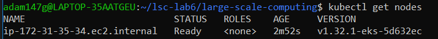

# large-scale-computing - lab6 - Kubernetes - Adam Górka

To run the Kubernetes application you described, here's a breakdown of the required commands for each step:

## 1. Set up AWS CLI and Kubectl (for EKS)
### Update the package list and install the tools curl, unzip, python3-pip, awscli, and jq on the system.
```bash
sudo apt update && sudo apt install -y curl unzip python3-pip awscli jq
```

### Install kubectl (Kubernetes CLI)
```bash
curl -LO https://dl.k8s.io/release/v1.29.3/bin/linux/amd64/kubectl
chmod +x kubectl
sudo mv kubectl /usr/local/bin/
kubectl version --client
```
## 2. Create the EKS Cluster and Nodegroup

Check subnets, security groups and roles, type:
```bash
aws ec2 describe-subnets --region us-east-1
aws ec2 describe-security-groups --region us-east-1
aws iam list-roles
```

### Create the EKS Cluster
```bash
aws eks create-cluster --region us-east-1 --name lsc-cluster --role-arn arn:aws:iam::671654311992:role/LabRole --resources-vpc-config subnetIds=subnet-0e2aeb6d321c8f53a,subnet-0a7562fdfba692612 securityGroupIds=sg-018e137708fbf6f24
```

*Wait until cluster is created*

### Create Nodegroup for the Cluster
```bash
aws eks create-nodegroup --cluster-name lsc-cluster --nodegroup-name lsc-ng --node-role arn:aws:iam::671654311992:role/LabRole --subnet subnet-0e2aeb6d321c8f53a subnet-0a7562fdfba692612 --instance-types t3.medium --scaling-config minSize=1,maxSize=2,desiredSize=1 --disk-size 20 --ami-type AL2_x86_64
```

### Update Kubeconfig to interact with the cluster
```bash
aws eks --region us-east-1 update-kubeconfig --name lsc-cluster
kubectl get nodes  # Verify that the nodes are up and running
```



### After this steps, you will be able to see created cluster and Node gropup:


## 3. Install Helm (Package Manager for Kubernetes)

### Download and install Helm
```bash
curl https://raw.githubusercontent.com/helm/helm/master/scripts/get-helm-3 > get_helm.sh
chmod 700 get_helm.sh
./get_helm.sh
```

### Add the Helm repo for NFS server provisioner
```bash
helm repo add nfs-ganesha-server-and-external-provisioner https://kubernetes-sigs.github.io/nfs-ganesha-server-and-external-provisioner/
```

# Install the NFS server provisioner
```bash
helm install nfs-server-provisioner nfs-ganesha-server-and-external-provisioner/nfs-server-provisioner -f ./nfs-values.yaml
```
Make sure the nfs-values.yaml file contains your custom configuration (such as the correct storageClass.name for your Persistent Volume Claims).

## 4. Apply the Persistent Volume Claim (PVC)
### Apply PVC definition
```bash
kubectl apply -f ./kubectl_files/pvc.yaml
```
Ensure the pvc.yaml defines the PVC with the correct storageClass.name and matches the NFS provisioner's configuration.

If everything is fine, output should be like this:


## 5. Deploy the HTTP Server 

### Apply the HTTP server deployment 
kubectl apply -f ./kubectl_files/deployment.yaml

Ensure the deployment.yaml is configured to use the PVC as a volume for the web content directory.

## 6. Expose the HTTP Server with a Service

### Apply the service definition to expose the HTTP server
kubectl apply -f ./kubectl_files/service.yaml

Ensure the service.yaml configures the correct ports and type (e.g., LoadBalancer or NodePort) for external access.

## 7. Run a Job to Populate the NFS Volume with Sample Content

### Apply the job definition to populate the volume with sample content
kubectl apply -f ./kubectl_files/job.yaml

The job.yaml should mount the PVC and copy the sample content into the NFS directory.

## 8. Test the HTTP Server
Finally, after all the resources are deployed, test HTTP server by accessing it through a browser:

### Get the external IP or DNS of the LoadBalancer:
```bash
kubectl get svc lsc-service
```

Look for the external IP in the EXTERNAL-IP column, copy it and paste it in a web browser.


### Once done, you should see the sample content from the HTTP server displayed in the browser.


-------------------------------

## Short Description of the application
This Kubernetes-based application deploys a simple HTTP server that serves static content stored on a shared NFS volume. The application runs in an Amazon EKS cluster, using Helm to provision a dynamic NFS server, which backs a Persistent Volume Claim (PVC). A Kubernetes Job is used to pre-fill the NFS volume with content. Finally, the HTTP server is exposed externally via a LoadBalancer Service, making the content accessible via a browser.

### Key Features:
- Amazon EKS: Managed Kubernetes control plane on AWS.

- NFS Provisioner: Provides shared storage accessible to all pods.

- Persistent Volume Claim: Ensures stateful storage for HTTP content.

- Kubernetes Job: Populates NFS with sample data.

- HTTP Server Deployment: Serves the content from NFS.

- LoadBalancer Service: Exposes the server to the internet.

### Diagram


